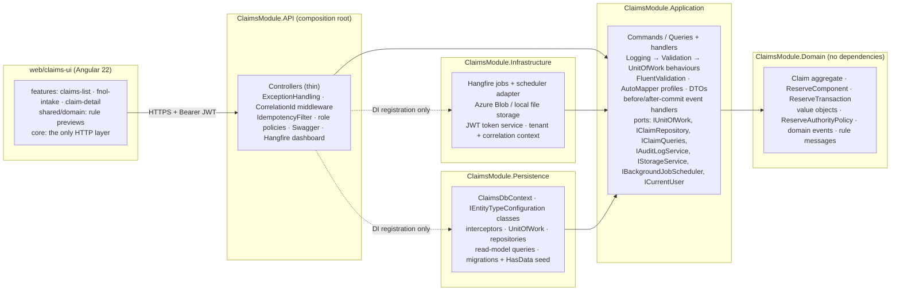
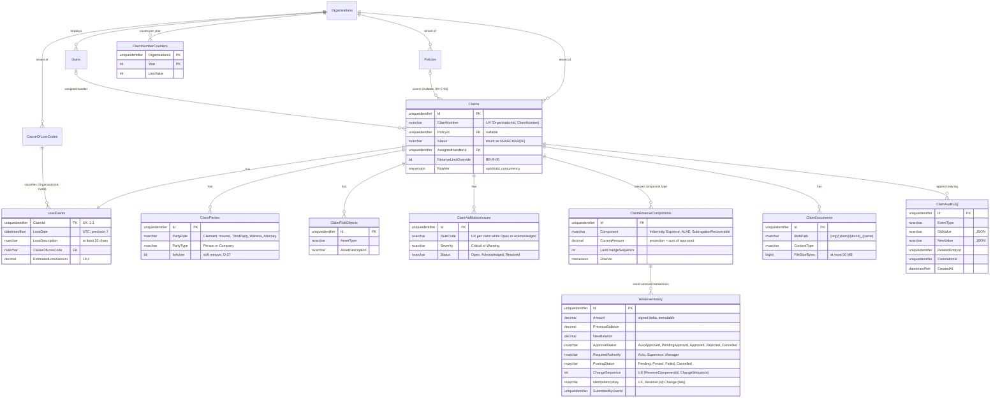
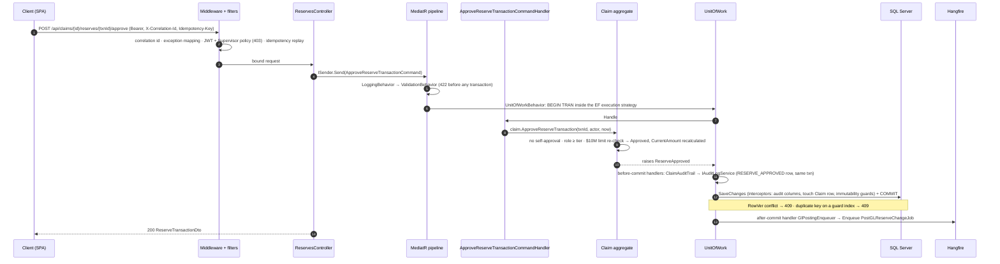
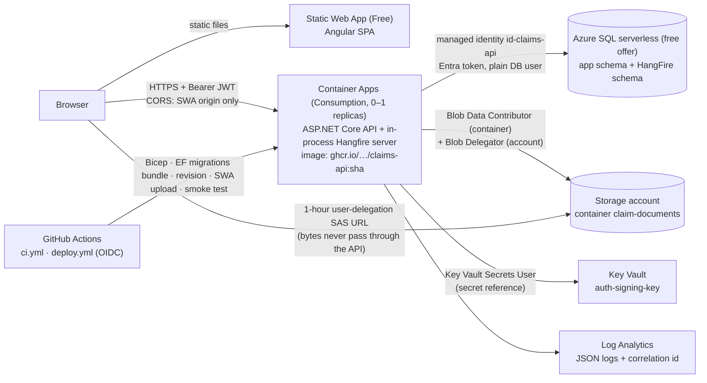

# Architecture

This document explains how the Claims module slice is built, and why. It covers brief §4.4:
1. Solution structure
2. Data model
3. CQRS flow
4. Domain events
5. Hangfire jobs
6. Azure architecture
7. Key decisions and trade-offs

`D-xx` refers to [docs/DECISIONS.md](docs/DECISIONS.md), where every choice is written up with its options. Requirement IDs (`BR-*`, `CC-*`,
`API-*` …) refer to [docs/REQUIREMENTS-MATRIX.md](docs/REQUIREMENTS-MATRIX.md), which links each one to its code and tests. The
phase-by-phase plan this document grew from is [docs/ARCHITECTURE-PLAN.md](docs/ARCHITECTURE-PLAN.md). Its §6.1 race-condition analysis was
written before the Phase 4 code.

---

## 1. Solution structure

| Project | Depends on | Holds |
|---|---|---|
| `ClaimsModule.Domain` | nothing | entities, value objects (`ClaimNumber`, `SanitisedFileName`, `DocumentBlobPath`, `GlIdempotencyKey`, …), enums, domain events, exceptions, the FRS §8 messages |
| `ClaimsModule.Application` | Domain | `VerbNounCommand` / `GetNounQuery` / `ListNounsQuery` + handlers, validators, DTOs, AutoMapper profiles, pipeline behaviours, the interfaces (ports) above |
| `ClaimsModule.Infrastructure` | Application | Hangfire jobs, `HangfireBackgroundJobScheduler`, `AzureBlobStorageService`, `LocalFileSystemStorageService`, `JwtTokenService`, simulated ledger |
| `ClaimsModule.Persistence` | Application | EF Core 9: context, Fluent configurations, interceptors, `UnitOfWork`, repositories, SQL read models, migrations, seed |
| `ClaimsModule.API` | all four | controllers, middleware, filters, auth policies, DI composition |

**How the dependency rule is enforced:**
- The project references make a wrong reference fail to compile.
- NetArchTest tests catch leaks through transitive references (`LayerDependencyTests`, CONV-14). For example, Application must not touch EF
  Core, SqlClient, ASP.NET Core, Hangfire or Azure types, and controllers must not touch Persistence.
- An IL scan forbids `DateTime.Now`/`UtcNow` and `DateTimeOffset.Now`/`UtcNow` in production code; time comes from `TimeProvider` (CONV-16).
- A reflection test checks that entities have no public setters (DOM-01).

The frontend follows the same idea. Only `core/api/*` services use `HttpClient`, which an ESLint `no-restricted-imports` rule enforces.
`shared/domain` holds pure functions that *preview* the domain rules, such as the authority tier, the in-force badge and the closure
checklist. The API is still the authority for every rule.

---

## 2. Data model

**The Claim aggregate.** `Claim` is the only aggregate root on the write side (ARCHITECTURE-PLAN §2). It contains:
- `LossEvent`;
- the parties, risk objects and validation issues;
- up to four `ReserveComponent`s, each with its `ReserveTransaction` rows (the `ReserveHistory` table);
- the document metadata.

Policy, cause-of-loss code, user and organisation sit outside the aggregate and are referenced by id. `ClaimAuditLog` belongs to no aggregate
and is written only through `IAuditLogService`.

Tables not drawn:
- `ClaimStatusTransitions` (FromStatus, ToStatus, MinimumRole, RequiresReason, IsSystemOnly): the seeded FRS §4.2 table, global.
- `IdempotencyRecords` (per user and key): HTTP replay store.
- Hangfire's `[HangFire]` schema.

**Conventions.** One model convention (`Conventions/ModelBuilderConventions.cs`) and `ClaimsDbContext.ConfigureConventions` apply these to
every table; `CONV-*` tests check each one:
- **Keys:** `UNIQUEIDENTIFIER` primary keys with a `NEWSEQUENTIALID()` default. The domain assigns SQL-Server-ordered sequential GUIDs at
  construction, so the columns are `ValueGeneratedNever` (D-30).
- **Money:** `decimal` → `DECIMAL(19,4)`. A scale guard rejects more than 4 decimal places.
- **Time:** `DateTimeOffset` → `DATETIMEOFFSET(7)`, always UTC.
- **Enums:** stored as `NVARCHAR(50)` through a value conversion.
- **Shadow properties:** the audit columns (`CreatedAt`, `UpdatedAt`, `UserCreated`, `UserModified`), the soft-delete columns (`IsDeleted`,
  `DeletedAt`) and the tenant column (`OrganisationId`). They are persistence bookkeeping, so the domain never sees them.
  `AuditColumnsInterceptor` fills them.
- **Global query filters:** one combined soft-delete + tenant filter per entity. It reads `CurrentOrganisationId` on the context instance, so
  EF parameterises it per query. With no tenant it fails closed.
- **Row versions:** `RowVer` on `Claims` and `ClaimReserveComponents`.
- **Fluent API only:** no data annotations.
- **Exceptions:** `ClaimAuditLog` is neither soft-deletable nor updatable (D-14). `ImmutableRowsInterceptor` throws on a modified or deleted
  audit row, and an `INSTEAD OF UPDATE, DELETE` trigger stops raw SQL and `ExecuteUpdate`. `ReserveHistory` is *amount-immutable*: the
  interceptor refuses changes to amount, balances, sequence and key, while approval and posting fields may change, as the FRS requires (D-22).

---

## 3. CQRS flow: a command from HTTP to the database

Reads and writes are separate MediatR requests: `ICommand<T>` vs `IQuery<T>` marker interfaces, and naming conventions tested by CONV-13.
- **Commands** load the aggregate through `IClaimRepository`, call one domain method, and run inside the unit of work.
- **Queries** never load aggregates. They call SQL projections behind `IClaimQueries` and friends, implemented in Persistence (D-40 item 1).
  The query counts are fixed and tested: the claims list is 2 SQL commands and the detail is 7, whatever the page size (no N+1).

The sequence below approves a reserve:

**Pipeline order** (`Application/DependencyInjection.cs`):
1. `LoggingBehavior`
2. `ValidationBehavior`: FluentValidation, all validators, errors grouped per field. The 422 body is exactly
   `{type, title, status, errors{field:[msgs]}}` (FRS §10.4).
3. `UnitOfWorkBehavior`: commands only.

One deliberate exception: the document upload command implements `IHandlesOwnUnitOfWork`. The blob is written *before* the transaction and
deleted again if the commit fails (D-42 Q1).

**Error mapping** (`ExceptionHandlingMiddleware`):

| Exception | HTTP status |
|---|---|
| `ValidationException`, `BusinessRuleViolationException` | 422 |
| `NotFoundException` (includes the tenant filter hiding another organisation's claim) | 404 |
| `ForbiddenAccessException` | 403 |
| `DbUpdateConcurrencyException`, `ConflictException` | 409 |
| anything else | 500, without details outside Development |

Every error is a ProblemDetails body; the correlation id is in the response header and on every log line.

**What the Unit of Work buys.** Audit rows and state commit together or not at all. The claim-number counter shares the claim's transaction,
so a rollback leaves no gap. Jobs are enqueued only for committed rows. Without the Unit of Work, each of these could diverge (REVIEW-PREP Q3).

---

## 4. Domain events

The aggregates raise **21 events**:
- `ClaimCreated`, `ClaimStatusChanged`, `ClaimClosed`, `ClaimReopened`
- `PartyAdded`, `PartyRemoved`, `RiskObjectAdded`
- `ValidationIssueRaised`, `ValidationIssueResolved`, `ValidationIssueAcknowledged`
- `PolicyLinked`, `HandlerAssigned`, `ClaimDetailsUpdated`, `ReserveLimitOverrideSet`
- `ReserveTransactionSubmitted`, `ReserveAutoApproved`, `ReserveApproved`, `ReserveRejected`, `ReserveRetracted`
- `GlPostingRetryRequested`
- `DocumentUploaded`

`UnitOfWork` collects them from every tracked aggregate after the handler runs. It dispatches them in two phases, through two explicit
handler interfaces rather than MediatR notifications, because the phase is the important fact about a handler:

| Phase | Interface | Handlers | Why this phase |
|---|---|---|---|
| **Before commit**, same transaction | `IBeforeCommitHandler<T>` | `ClaimAuditTrail`, one method per event → CLAIM_CREATED, STATUS_CHANGED, CLAIM_CLOSED, CLAIM_REOPENED, PARTY_ADDED/REMOVED, RESERVE_CREATED, RESERVE_AUTO_APPROVED, RESERVE_APPROVED, RESERVE_REJECTED, RESERVE_RETRACTED, DOCUMENT_UPLOADED, VALIDATION_ISSUE_ADDED/RESOLVED/ACKNOWLEDGED, RISK_OBJECT_ADDED, POLICY_LINKED, HANDLER_ASSIGNED, CLAIM_UPDATED, RESERVE_LIMIT_OVERRIDE_SET, GL_POSTING_RETRIED | the audit row must commit or roll back *with* the state change |
| **After commit** | `IAfterCommitHandler<T>` | `GlPostingEnqueuer` for `ReserveAutoApproved`, `ReserveApproved`, `GlPostingRetryRequested` | a job must never see uncommitted rows, nor run for a rolled-back approval |

Rules around the dispatch:
- A test fails if any event lacks a before-commit audit handler (`AUD_I1_Every_domain_event_has_a_before_commit_audit_handler`).
- Before-commit dispatch repeats until no new events appear.
- After-commit failures are logged per handler and never fail the request. The GL sweeper covers a lost enqueue.
- The two jobs write their own audit rows (GL_POSTING_SIMULATED, GL_POSTING_FAILED, SLA_BREACH_DETECTED) through `IAuditLogService` inside
  their command's unit of work.
- Each audit row carries the tenant, the actor, UTC time and the request's correlation id. Jobs use their own correlation id.

---

## 5. Hangfire jobs

Hangfire lives only in Infrastructure; Application sees `IBackgroundJobScheduler`. The job classes are thin. Each one:
1. resolves the tenant (D-31);
2. opens a DI scope with a fresh correlation id;
3. sends an Application command, so jobs use the same pipeline and unit of work as HTTP requests.

Storage is SQL Server, the `[HangFire]` schema in the same database. The dashboard at `/hangfire` is manager-only and read-only.

| Job | Trigger | Idempotency and safety | Failure |
|---|---|---|---|
| `PostGLReserveChangeJob(reserveHistoryId, claimId, idempotencyKey)` | after-commit enqueue on auto-approval, approval or a retry of a failed posting; the sweeper | see below | `[AutomaticRetry(Attempts = 3)]`, 10/30/60 s. The last attempt sets `Failed` (same compare-and-set on `Pending`), writes GL_POSTING_FAILED in a new unit of work, and rethrows so Hangfire shows the job Failed. Recovery: `POST …/retry-posting` (audited, Failed → Pending, re-enqueued) |
| `SlaMonitoringJob` | recurring `*/15 * * * *`, registered at startup | Draft/Open claims with `COALESCE(UpdatedAt, CreatedAt) < now − 48h` and no SLA_BREACH_DETECTED in the last 24h get one audit row each. **Never changes the claim** (D-01). `[DisableConcurrentExecution]` | the next run re-evaluates |
| `GlPostingSweeperJob` | every 5 min | re-enqueues approved rows still `Pending` 5 min after approval (D-15). A double enqueue is harmless | next run |
| `IdempotencyCleanupJob` | daily | deletes Idempotency-Key records older than 24h | next run |

**How GL idempotency works** (BR-R-06, ARCHITECTURE-PLAN §6.1 R6–R9):
- The key is `Reserve:{ReserveComponentId}:Change:{ChangeSequence}` (`GlIdempotencyKey`). The sequence is per component and protected by
  its RowVer.
- The job never checks and then acts. `GlPostingStore.TryMarkPostedAsync` runs one statement:
  `UPDATE ReserveHistory SET PostingStatus='Posted' … WHERE Id=@id AND ClaimId=@claim AND IdempotencyKey=@key AND PostingStatus='Pending'
  AND ApprovalStatus IN ('Approved','AutoApproved')`.
- Only when exactly one row changed does the job post to the simulated ledger (with the key) and stage GL_POSTING_SIMULATED. All of this is
  in one transaction.
- A concurrent duplicate blocks on the row lock, then its WHERE clause fails against the committed row: 0 rows, no-op. A sequential repeat
  also changes 0 rows.
- Backstops: a unique index on the key, and a unique filtered index that allows one GL_POSTING_SIMULATED audit row per transaction.
- `= 'Pending'` rather than `<> 'Posted'` means a Failed posting can be retried only through the audited endpoint (D-41 Q1).
- Proven by `BR_R_06_Job_run_concurrently_writes_one_gl_audit_entry`: the test waits until SQL Server shows the second run blocked on the
  first run's lock. Dropping the `Pending` predicate makes four tests fail.
- The job updates only its `ReserveHistory` row, with `ExecuteUpdate`. The claim is not touched, so a system posting neither resets the SLA
  clock nor causes a user's edit to fail with 409.

---

## 6. Azure architecture

- **No stored secrets.** The API's only credential is a user-assigned managed identity. SQL uses Entra-only authentication, and the API is a
  plain database user with reader/writer rights plus `claims_app`, and owns `[HangFire]`. Blob storage has shared keys disabled, so SAS URLs
  are user-delegation SAS. The JWT key is a Key Vault reference. GitHub signs in to Azure with an OIDC federated credential (D-44).
- **Pipeline** (`.github/workflows/deploy.yml`, manual). In order:
  1. `ci.yml`: build, .NET tests, Angular lint/test/build.
  2. Push the image to ghcr.io.
  3. `infra/main.bicep`.
  4. The signing key, once.
  5. The EF migrations bundle against Azure SQL.
  6. `infra/sql/grant-api-identity.sql`.
  7. `infra/api.bicep`, a new revision gated on `/health/ready`.
  8. The SPA built with the API URL and uploaded.
  9. `scripts/smoke-test.sh`: the brief §7.2 flow plus CORS and SPA deep links.

  First green run: 36446032128.
- **Probes.** Liveness `/health/live` has no dependencies, so a pausing database never restarts the container. Readiness `/health/ready`
  checks the database.
- **Runbook, manual steps and teardown:** [docs/DEPLOYMENT.md](docs/DEPLOYMENT.md).

---

## 7. Key design decisions and trade-offs

| Decision | Why | Trade-off accepted |
|---|---|---|
| **ReserveComponent is inside the Claim aggregate**, and every change touches the Claim row (ARCHITECTURE-PLAN §2.2) | The $10M limit, closure, the no-policy rule and the read-only status span components. Separate aggregates would allow write skew: two $6M approvals on different components, each passing the check | Commands on the *same* claim serialise optimistically (409 → retry). Irrelevant at claims-handling volumes. Proven by `BR_R_05_Concurrent_approvals_cannot_jointly_exceed_limit` (mutation-checked) |
| **Claim number from a counter table** (`UPDATE … OUTPUT INSERTED` in the create transaction), not a SEQUENCE (D-10) | FRS §5.3 says "no gaps". A SEQUENCE leaks values on rollback and on cache loss | Creates serialise per organisation and year for one short transaction. `BR_C_04_50_parallel_creates_yield_unique_gap_free_numbers` |
| **Event-sourced reserves**: INSERT a signed-delta transaction; `CurrentAmount` = Σ approved, recalculated in the same transaction (D-05, D-11, D-22) | Full history, replayable balance, no lost updates | ReserveHistory rows are amount-immutable, not row-immutable. Approval and posting fields change, as the FRS requires. One pending transaction per component keeps the balance chain linear |
| **Authority on \|delta\|**; crossing $10M escalates the transaction to Manager and warns (D-05, D-11) | A large *release* needs the same authority as a large increase. The FRS says the override must exist "before the reserve can be approved", which the approval re-checks | Subrogation is excluded from the aggregate: it is an expected recovery, not headroom (ASSUMPTION in D-11) |
| **Hybrid intake validation** (D-06) | Rules that make data meaningless or unpersistable give 422 (future date, bad cause code, <20 chars). Completeness gaps (no claimant, no policy, out-of-period) are persisted issues on a Draft, which FRS §5.4 describes | A direct API caller can create a claimant-less Draft. The UI blocks it; Draft → Open enforces it |
| **Audit before commit, jobs after commit, plus a sweeper** instead of a full outbox (D-15) | The same guarantee for this scope: the ReserveHistory row itself is the outbox (`PostingStatus = Pending`) | Up to 5 minutes of delay if an enqueue is lost |
| **SLA breach in the audit log, not a status or flag** (D-01) | The FRS says "do not change claim status". Writing a flag would bump `UpdatedAt` and reset the very clock the job measures | The brief's "SlaBreached status" wording is not followed literally. The list derives the flag from the audit log |
| **403 vs 422** (D-25) | 403 when the role can *never* do it (handler approving). 422 when it depends on the data (supervisor approving $250k, with the FRS §8 message) | Two status codes for "not allowed", each with a reason |
| **Idempotency-Key as an ASP.NET filter**, not a MediatR behaviour (D-24) | What gets replayed is an HTTP response (status, body, Location) | Only 2xx responses are stored, so a client can retry after 409 or 5xx |
| **Container Apps + serverless SQL** instead of App Service (D-36) | Scale-to-zero stops Hangfire polling, so the database can pause. Idle cost is about $0 | Cold start of about a minute; the SLA job runs only while a replica is up. The live-review runbook sets `minReplicas 1` |
| **MediatR 12 / AutoMapper 14** (D-37) | The last freely licensed majors | AutoMapper 14 has CVE-2026-32933. It is suppressed for that one advisory only, with two guard tests: request input is never mapped, and no mapped type references itself |
| **Blob first, metadata second** for uploads (D-42 Q1) | The bytes do not belong in a SQL transaction | The handler deletes the blob if the commit fails, and keeps it if the row did commit |

**Known limits and what would change for production** (also in REVIEW-PREP):
- A real ledger client would be called outside the row lock with the idempotency key (claim `Posting` → call → `Posted`).
- Hangfire's schema would be installed by the deployment, not by the app.
- Recurring jobs would isolate failures per tenant.
- Uploads would be scanned for malware.
- An identity provider would replace the dev-token endpoint behind the same `JwtBearer` validation.
- Named query filters (EF 10) would replace the single combined filter.
